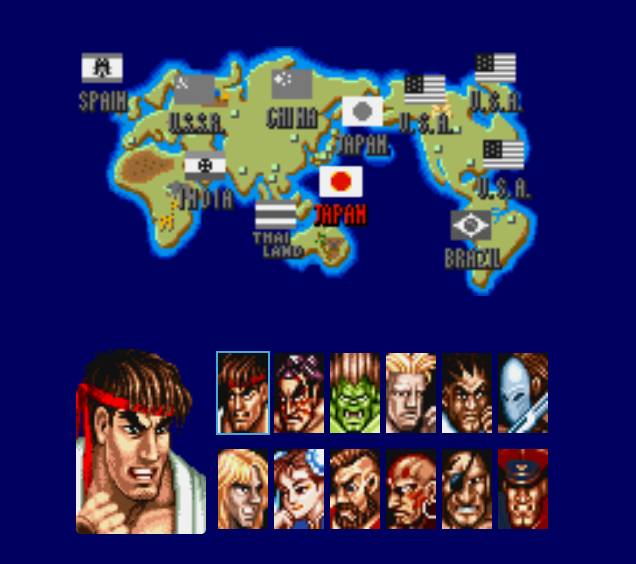

# 
 Street Fighter 2 - Select Screen 

    
    
    

    

## Getting Started

- To get a local copy up and running follow these simple example steps.

### Installation

- Clone the repo

       git clone git@github.com:LucasAlvaresA/street-fighter2-selection.git
       
- Install NPM packages

      npm install

- Run the project

      npm run dev

